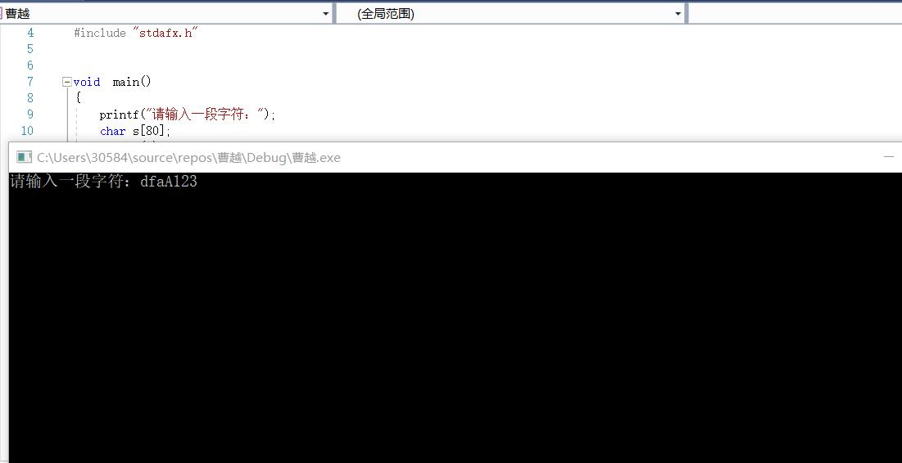
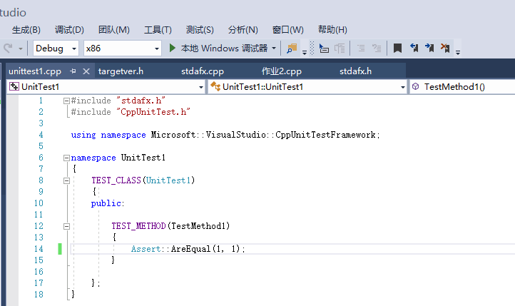

第三次作业 code review
============================
#include "stdafx.h"

void  main()
{
	printf("请输入一段字符：");     
	char s[80];     
	gets_s(s);      
	int a = 0,       b = 0,      c = 0,      d = 0,      e = 0,          i;     
	for (i = 0; s[i] != '\0'; i++)      
	{
		if ((s[i] <= 'Z') && (s[i] >= 'A'))             
		{
			a++; 
		}       
		else if ((s[i] <= 'z') && (s[i] >= 'a'))        
		{
			b++;
		}       
		else if ((s[i] <= '9') && (s[i] >= '0'))        
		{
			c++;
		}       
		else if (s[i] == ' ')       
		{
			d++;
		}       
		else        
		{
			e++;
		}       
	}       
	printf("大写字母数为：%d\n", a);        
	printf("小写字母数为：%d\n", b);        
	printf("数字数为：%d\n", c);        
	printf("空格数为：%d\n", d);        
	printf("其他特殊含义字符数为：%d\n", e);        
}

效果图:
--------

## 问题

* 1.else if 结构嵌套混乱，不符合封闭原则。
* 2.容错机制较差，若输入不符合格式则不能进行。

* 3.没有人机交互界面，不方便用户使用。		
* 4.缺乏功能扩展，比如增加字符总数的计算，或者将其他字符再进行划分。 